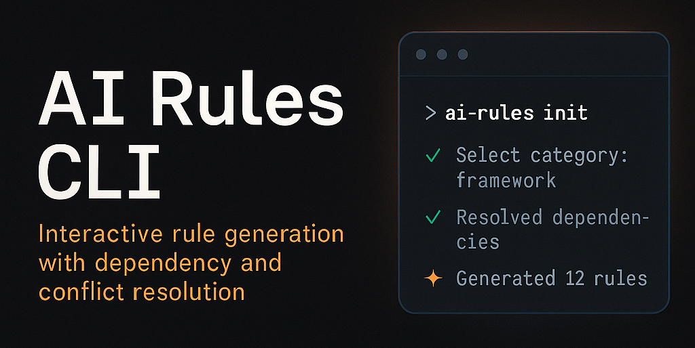

<!-- Banner -->
<p align="center">
  
</p>
<h1 align="center">AI Rules CLI</h1>
<p align="center"><strong>Interactive rule generation with dependency and conflict resolution</strong></p>

<p align="center">
  <a href="https://github.com/rerades/ai-rules">Demo Rules Repository</a> •
  <a href="#Features">Features</a> •
  <a href="#Installation">Installation</a> •
  <a href="#Configuration">Configuration</a> •
  <a href="#Usage">Usage</a> •
  <a href="#Rule Schema">Rule Schema</a> •
  <a href="#Output Structure">Output Structure</a> •
  <a href="#Development">Development</a> •
  <a href="#Architecture">Architecture</a> •
  <a href="#Error Handling">Error Handling</a>

</p>

---

## 📋 Overview

AI Rules CLI is a command-line tool for managing and composing rule sets defined in ai-rules.
It provides an interactive wizard, schema validation, dependency resolution, and conflict detection — all fully typed with TypeScript.

---

## ✨ Features

- **Interactive Wizard**: Step-by-step rule selection with visual feedback
- **Dependency Resolution**: Automatically resolves rule dependencies
- **Conflict Detection**: Identifies and helps resolve rule conflicts
- **Schema Validation**: Validates rules against the MDC schema
- **Multiple Commands**: List, validate, check, and generate rules
- **TypeScript**: Fully typed with strict mode

---

## 📦 Installation

### • Global Installation

```bash
npm install -g ai-rules-cli
```

### • Using npx (Recommended)

```bash
npx ai-rules-cli init
```

### • Local Development

```bash
git clone https://github.com/rerades/ai-rules-cli.git
cd ai-rules-cli
npm install
npm run build
npm link
```

---

## ⚙️ Configuration

### • QUICK RULES SETUP

**Note:** This CLI does not include any predefined rules. To use your own rules, you must specify where the CLI can find them. By default, the CLI will look for rules in your user directory at `~/ai-rules` (you can change this path using environment variables).

Any new rule that you define _must follow_ [the predefined schema](./mdc.schema.json) created in this repository.

For a quick rules setup, I also maintain a [repository with example rules](https://github.com/rerades/ai-rules) that you can fork to create your own rule sets.

You can copy the rules to the default repository path `~/ai-rules` to get started quickly.

The CLI uses the following default configuration:

- **Repository Path**: `~/ai-rules` - This is where your rules are saved
- **Rules Directory**: `rules`
- **Schema File**: `mdc.schema.json`
- **Output Directory**: `.cursor/rules`

You can override these settings using environment variables:

| Variable               | Default         | Description                       |
| ---------------------- | --------------- | --------------------------------- |
| `AI_RULES_REPO_PATH`   | `~/ai-rules`    | Repository where rules are stored |
| `AI_RULES_OUTPUT_PATH` | `.cursor/rules` | Output folder                     |
| `AI_RULES_VERBOSE`     | `false`         | Enable verbose logging            |

```bash
export AI_RULES_REPO_PATH="/path/to/your/rules/repo"
export AI_RULES_OUTPUT_PATH="/path/to/output"
export AI_RULES_VERBOSE=true
```

---

## 🚀 Usage

### • Initialize a new project

```bash
ai-rules init
```

This will launch the interactive wizard to:

1. Select rule categories
2. Choose specific rules
3. Configure output directory
4. Resolve dependencies and conflicts
5. Generate rule files

### • List available rules

```bash
ai-rules list
```

Options:

- `-c, --category <category>` - Filter by category
- `-s, --search <query>` - Search rules by title or summary
- `-v, --verbose` - Show detailed information

### • Validate rules

```bash
ai-rules validate
```

Options:

- `-v, --verbose` - Show detailed validation results

### • Check dependencies and conflicts

```bash
ai-rules check <rule-ids...>
```

Options:

- `-v, --verbose` - Show detailed information

### • Generate rules directly

```bash
ai-rules generate <rule-ids...> -o <output-path>
```

Options:

- `-o, --output <path>` - Output directory path
- `--dry-run` - Simulate without creating files
- `-m, --minify-frontmatter` - Emit minimal frontmatter (required fields only)
- `--keep <fields>` - Comma-separated optional fields to retain with minify (e.g., `description,scope,enforcement`)
- `-v, --verbose` - Enable verbose output

#### Frontmatter modes

- Minimal (with `-m`):

```yaml
---
id: foundation.response-deliverables.structure
version: 1.0.0
title: "Response Deliverables — Structure"
category: foundation
---
```

- Extended (default or allowlisted via `--keep`):

```yaml
---
id: foundation.response-deliverables.structure
version: 1.0.0
title: "Response Deliverables — Structure"
category: foundation
description: "Rules for structuring responses with status, edits, and impact summary."
scope: ["global"]
language: "none"
enforcement: { lint: "warn", ci: "allow", scaffold: "none" }
---
```

---

## 📋 Rule Schema

Rules must follow the MDC (Markdown with frontmatter) schema defined in `mdc.schema.json`. Each rule file should have:

- **Frontmatter**: YAML metadata with rule information
- **Content**: Markdown content with the actual rule

Example rule structure:

```yaml
---
id: "foundation.code-guidelines"
version: "1.0.0"
title: "Code Guidelines"
summary: "Basic coding standards and best practices"
category: "foundation"
scope: ["global"]
language: "ts"
lifecycle: "recommended"
maturity: "stable"
order: 10
---
# 📝 Code Guidelines

This rule defines basic coding standards...
```

---

## 📁 Output Structure

The CLI generates the following structure:

```
.cursor/
└── rules/
    ├── index.md
    ├── foundation.code-guidelines.mdc
    ├── typescript.conventions.mdc
    └── ...
```

### • Index File

The `index.md` file contains:

- Overview of all rules
- Categorization
- Rule metadata
- Usage instructions

### • Rule Files

Each rule file (`.mdc`) contains:

- YAML frontmatter with metadata
- Markdown content with the actual rule

---

## 🛠️ Development

### • Prerequisites

- Node.js 18+
- TypeScript 5+
- npm or yarn

### • Setup

```bash
git clone <repository-url>
cd ai-rules-cli
npm install
```

### • Build

```bash
npm run build
```

### • Development

```bash
npm run dev
```

### • Testing

```bash
npm test
```

### • Linting

```bash
npm run lint
npm run lint:fix
```

---

## 🏗️ Architecture

The CLI is built with a modular architecture:

```
src/
├── core/           # Core business logic
│   ├── config.ts   # Configuration management
│   ├── rule-loader.ts      # Rule loading and parsing
│   ├── rule-validator.ts   # Schema validation
│   └── dependency-resolver.ts # Dependency resolution
├── ui/             # User interface
│   ├── wizard.ts   # Interactive wizard
│   ├── prompts.ts  # Inquirer prompts
│   ├── formatters.ts # Visual formatting
│   └── spinner.ts  # Loading indicators
├── generators/     # File generation
│   ├── output-generator.ts # Rule file generation
│   └── index-generator.ts  # Index file generation
├── utils/          # Utilities
│   ├── logger.ts   # Logging
│   └── file-utils.ts # File operations
├── types/          # TypeScript types
│   ├── rule.types.ts
│   ├── config.types.ts
│   └── wizard.types.ts
└── index.ts        # CLI entry point
```

---

## ⚠️ Error Handling

The CLI provides comprehensive error handling:

- **Validation Errors**: Clear messages for schema violations
- **Dependency Errors**: Missing dependencies are reported
- **Conflict Errors**: Rule conflicts are identified and resolved
- **File Errors**: File system operations are handled gracefully
- **User Errors**: Invalid inputs are caught and reported

---

## 🤝 Contributing

1. Fork the repository
2. Create a feature branch
3. Make your changes
4. Add tests
5. Submit a pull request

---

## 📄 License

MIT License - see LICENSE file for details.

---

## 💬 Support

For issues and questions:

- Create an issue on GitHub
- Check the documentation
- Review the examples

---

## 🪪 License

MIT © [Rodrigo Erades](https://github.com/rerades)
